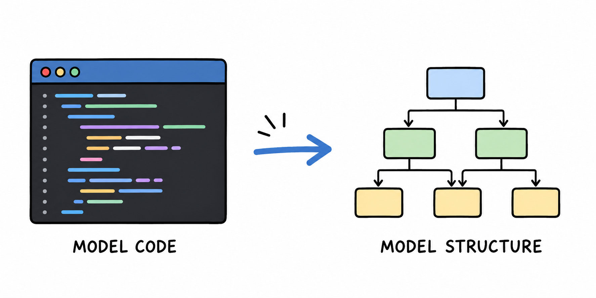
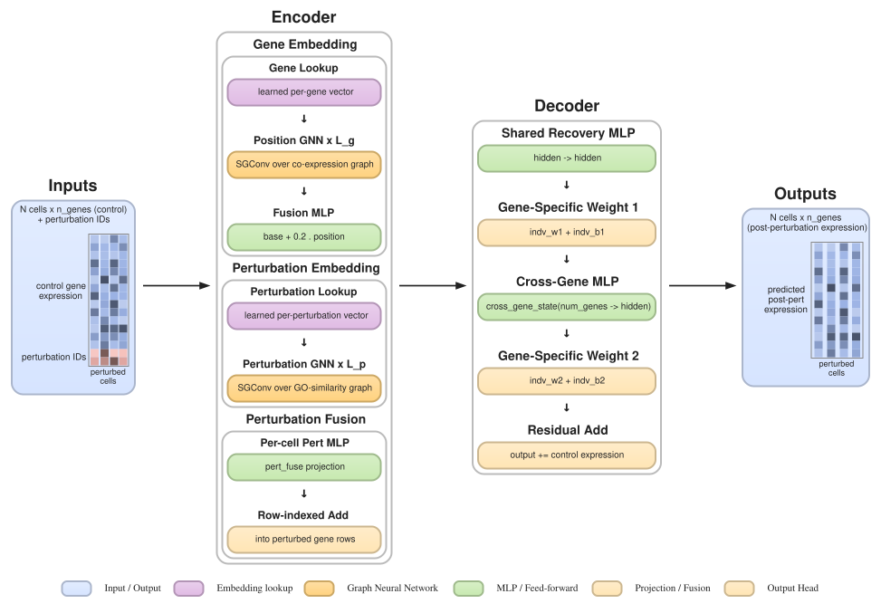
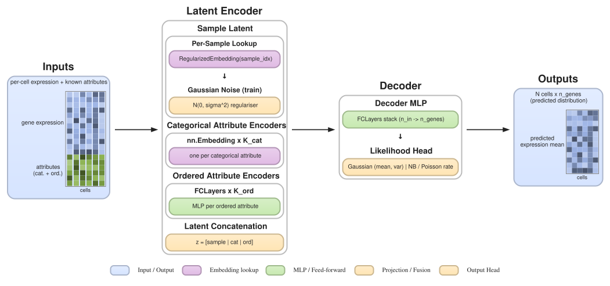

# draw-model-structure

AI skill with scripts to build clear and editable model architecture diagram just from the model codes.

---

## Requirements

- Python 3.9+
- Graphviz

---

## Gallery

Two real-world example specs live in `examples/`. Source specs:
[`examples/gears_spec.py`](examples/gears_spec.py) and
[`examples/biolord_spec.py`](examples/biolord_spec.py).

### GEARS — graph-enhanced perturbation response model

Two graph encoders (a co-expression GNN over genes and a GO-similarity
GNN over perturbations) feed a gene-specific decoder; the control
expression is added back at the end as a residual.

### Biolord — disentangled attribute-aware autoencoder

A composite latent disentangles per-sample "unknown" variation from
known categorical and ordered attributes; the decoder maps the
concatenated latent back to a Gaussian / NB / Poisson gene-expression
distribution.

---

## Quick start

Point the agent to the code files with this skill for diagram generation.  
Output SVG files for further editing.

---

